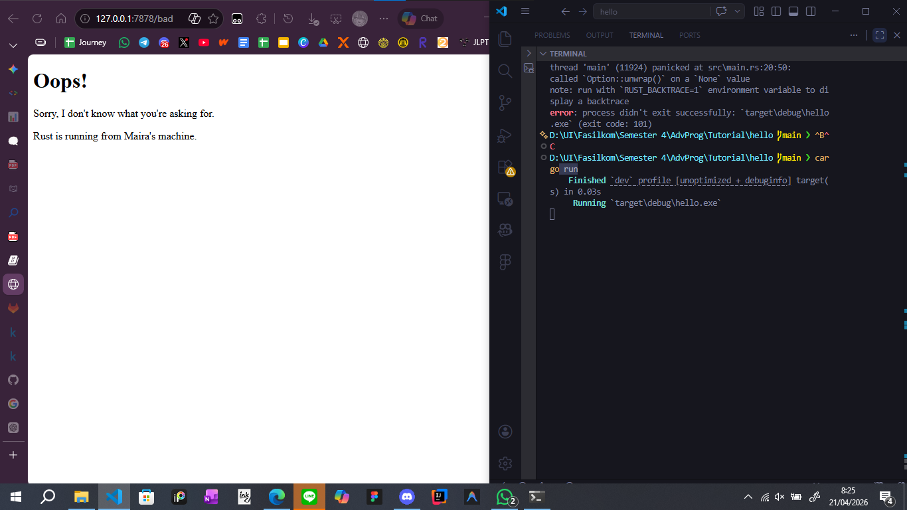

# Reflection

## Commit 1 Reflection Notes
I didn't expect to learn to make server this early. The single and multi-threaded concept I learnt before mid-exam was make sense yet hard to build, I thought. But this first commit, it shows that I already make a simple single-threaded server that can recieve a job and return the specification of the job. It wasn't really hard but I'm sure that common server out there is more complicated than this.

## Commit 2 Reflection Notes

This commit focuses on giving a response to the user when a thread completes its job, regardless of the status it returns. I learned that a thread can complete a job without informing the user. Therefore, returning a response is essential to keep the user informed and to protect communication between the server and the user.

## Commit 3 Reflection Notes

I learned how to validate requests and selectively respond to the user based on the URL they access. Previously, the server would return the same page regardless of the request. Now, I have implemented a check for the "Request Line" to see if it matches GET / HTTP/1.1. Instead of having multiple blocks of code reading files and writing to the stream, I used an if/else block to determine the status_line and the filename. NOw, if the user requests an invalid path, the server now correctly returns a 404 NOT FOUND status and displays 404.html.

## Commit 4 Reflection Notes
I learnt the flaw of single-threaded server. I simulated a slow response by adding a /sleep route that triggers thread sleeps for555 10 seconds. I saw firsthand how a single-threaded server works. When I accessed 127.0.0.1:7878/sleep in one tab and immediately tried to open 127.0.0.1:7878 in another, the second tab was completely blocked and had to wait for the first one to finish. This happens because the server can only handle one request at a time and cannot process the new connection until the first one is done.

