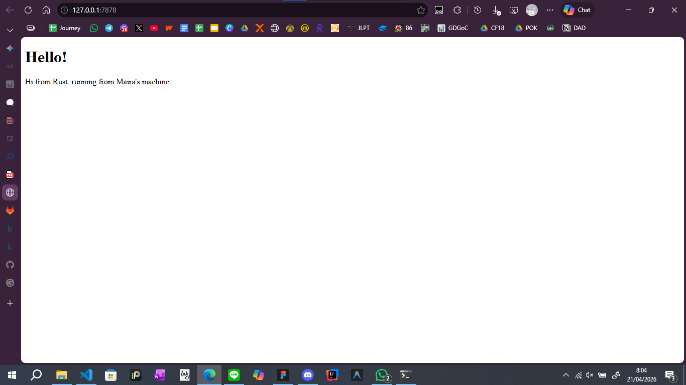

# Reflection

## Commit 1 Reflection Notes
I didn't expect to learn to make server this early. The single and multi-threaded concept I learnt before mid-exam was make sense yet hard to build, I thought. But this first commit, it shows that I already make a simple single-threaded server that can recieve a job and return the specification of the job. It wasn't really hard but I'm sure that common server out there is more complicated than this.

## Commit 2 Reflection Notes

This commit focuses on giving a response to the user when a thread completes its job, regardless of the status it returns. I learned that a thread can complete a job without informing the user. Therefore, returning a response is essential to keep the user informed and to protect communication between the server and the user.

